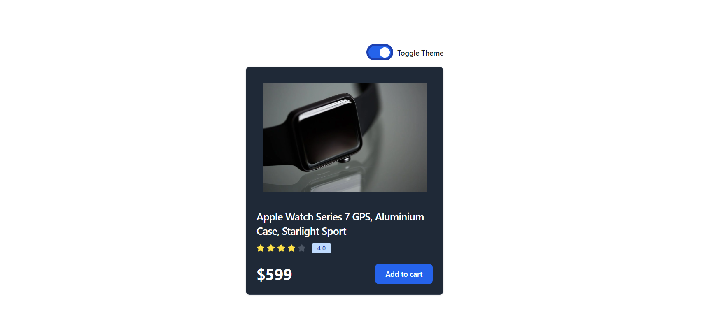

# Theme Toggler App

This Theme Toggler app allows users to toggle between light and dark themes. It is built using React and utilizes the Context API for managing the theme state across components.

## Preview

## Features

- Toggle between light and dark themes
- Context API for state management

### How to Download and Use:
1. Clone the repository to your local machine.
2. Navigate to the project directory.
3. Install dependencies using `npm install`.
4. Run the development server using `npm start`.
5. Open your web browser and visit the provided localhost address to access the application.

## How to Use

Simply click on the "Toggle Theme" checkbox to switch between light and dark themes.

## Technologies Used

- React
- Context API

## Learnings

- Implementation of dark mode and light mode themes in a React application
- Usage of the Context API for state management across components

